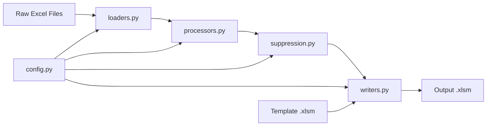
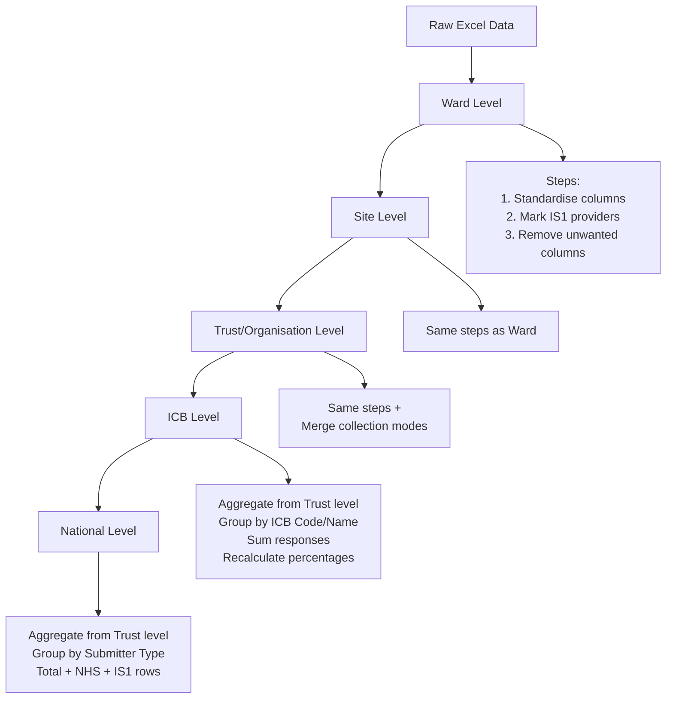
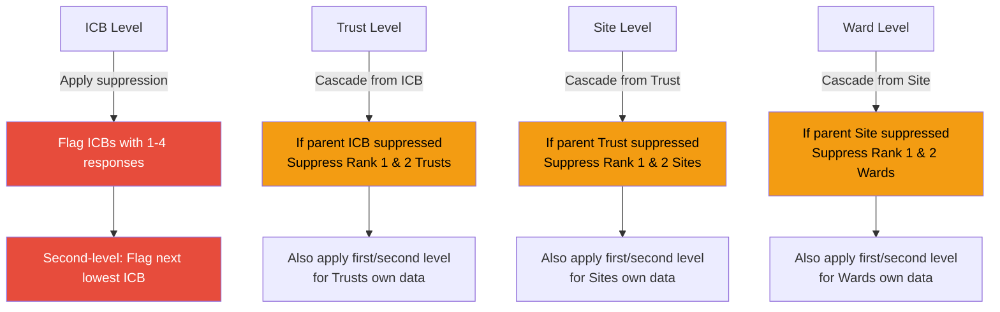

# FFT Pipeline

**Automated processing of NHS Friends and Family Test (FFT) data into publishable reports via CLI or web interface.**

## What This Does

The Friends and Family Test (FFT) is the UK's largest patient feedback programme, collecting ~2 million responses monthly. This pipeline transforms raw monthly FFT Excel data into formatted, suppression-compliant reports published by NHS England. Reports are published with a monthly cadence at the NHS England [Friends and Family Test data](https://www.england.nhs.uk/fft/friends-and-family-test-data/) page.

**Available interfaces:**
- **Command line interface** for automated/scripted processing
- **Web interface** for interactive use via browser

Supports multiple service types:
- **Inpatient services** (Ward → Site → Trust → ICB)
- **A&E services** (Site → Trust → ICB) _coming soon_
- **Ambulance services** (Trust → ICB) _coming soon_

## Key Features

### Privacy-First Suppression
Implements cascading suppression rules to prevent patient identification:
- Any organisation with 1-4 responses gets suppressed (replaced with `*`)
- Second-level suppression prevents reverse calculation
- Cascade suppression flows from parent to child levels (ICB → Trust → Site → Ward)

### Multi-Level Aggregation
Processes data at multiple geographic levels:
- Aggregates responses by Likert scale (Very Good → Very Poor)
- Calculates percentage positive/negative at each level
- Maintains organisational hierarchy throughout

### Rolling Totals
Maintains historical cumulative statistics in CSV format:
- Monthly submission counts (NHS vs Independent providers)
- Cumulative response totals
- Monthly percentage positive/negative trends

### Template-Based Output
Generates macro-enabled Excel reports matching NHS England publication standards:
- Pre-formatted sheets for Summary, ICB, Trust, Site, Ward levels
- Dynamic filtering via backend dropdown lists
- Consistent formatting across all service types

### Web Interface
Simple browser-based interface for interactive pipeline operations:
- Service type selection with dynamic file discovery
- Month filtering with "All months" option
- Real-time status updates and log output
- One-click output folder access
- Accessible design with dark mode support

## Quick Start

```bash
# Create virtual environment and install dependencies
uv venv
uv sync
```

### Option 1: Web Interface

```bash
# Start web interface (opens automatically in browser)
uv run python src/app.py
```

### Option 2: Command Line

```bash
# Run for inpatient data (default: latest 2 months)
uv run python -m fft --ip

# Run for A&E data
uv run python -m fft --ae

# Run for ambulance data
uv run python -m fft --amb
```

## Installation Requirements

This project uses `uv` for dependency management. Your `pyproject.toml` contains all required packages. Simply:

```bash
uv venv
uv sync
```

## Project Structure

```
fft_pipeline/
├── src/
│   ├── app.py          # FastHTML web interface
│   └── fft/
│       ├── config.py       # Centralised configuration (paths, mappings, constants)
│       ├── loaders.py      # Data loading from Excel files
│       ├── processors.py   # Transformation pipeline (rename, aggregate, calculate)
│       ├── suppression.py  # Privacy suppression logic (first/second/cascade)
│       ├── writers.py      # Excel output generation
│       └── utils.py        # Helper functions (validation, etc.)
├── data/
│   ├── inputs/
│   │   ├── raw/               # Monthly raw Excel files (FFT_IP_V1 Aug-25.xlsx)
│   │   ├── rolling_totals/    # Historical CSV files (rolling_totals_inpatient.csv)
│   │   └── templates/         # Excel templates (FFT-inpatient-data-template.xlsm)
│   └── outputs/               # Generated reports (FFT-inpatient-data-Aug-25.xlsm)
```

## Data Flow



## How Suppression Works

**The Problem**: Small response counts (< 5) could identify individual patients.

**The Solution**: Three-level suppression cascade

1. **First-level**: Any row with 1-4 responses gets all Likert responses replaced with `*`
2. **Second-level**: The next-lowest responding organisation also gets suppressed (prevents "Total - Known = Suppressed" calculation)
3. **Cascade**: If a parent level (e.g., ICB) requires suppression, the two lowest-responding children (e.g., Trusts) also get suppressed

**Example**:
```
ICB North (232 responses - suppressed due to having a Trust with 2 responses)
├─ Trust A: 150 responses → Shown
├─ Trust B: 80 responses → * (cascade suppression - Rank 2)
└─ Trust C: 2 responses → * (first-level suppression - Rank 1)
```

Without cascade suppression, someone could calculate: `232 - 150 = 82`, revealing Trust C's data.

### Geographic Level Processing Pattern 



### Suppression Cascade Logic



## Example File Locations

```
data/inputs/raw/
├── FFT_IP_V1 Aug-25.xlsx       # Current month inpatient
├── FFT_IP_V1 Jul-25.xlsx       # Previous month inpatient
└── FFT_AE_V1 Aug-25.xlsx       # Current month A&E

data/inputs/rolling_totals/
├── rolling_totals_inpatient.csv
└── rolling_totals_ambulance.csv

data/inputs/templates/
├── FFT_IP_template.xlsm
├── FFT_AE_template.xlsm
└── FFT_Amb_template.xlsm

data/outputs/
├── FFT-inpatient-data-Aug-25.xlsm
└── FFT-ambulance-data-Aug-25.xlsm
```

## Testing

Functions use doctests for inline testing:

```bash
# Run doctests quietly (only shows failures)
uv run python -m doctest $(find src/fft/ -name "*.py" -not -name "__main__.py")
```

## Development Status

**Current**: Inpatient pipeline (Ward → Site → Trust → ICB)  
**Next**: A&E pipeline (Site → Trust → ICB)  
**Future**: Ambulance pipeline (Trust → ICB)

---

*This pipeline processes official NHS England data. Handle with care and ensure GDPR compliance.*
